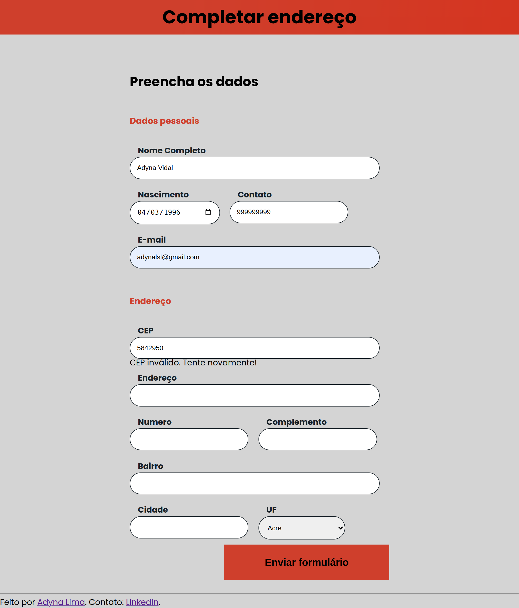

# Autocompletar endereço pelo CEP

Este é um projeto de uma página de endereço para preenchimento automático das informações quando o CEP for preenchido pelo usuário. 

## Índice

- [Visão geral](#visão-geral)
  - [O desafio](#o-desafio)
  - [Captura de tela](#captura-de-tela)
  - [Links](#links)
- [Meu processo](#meu-processo)
  - [Tecnologias utilizadas](#tecnologias-utilizadas)
  - [O que aprendi](#o-que-aprendi)
  - [Status do projeto](#status-do-projeto)
  - [Recursos úteis](#recursos-úteis)
- [Autora](#autora)
- [Licença](#licença)

## Visão geral

### O desafio

Os usuários devem ser capazes de:

- Preencher o CEP 
- Visualizar as informações preenchidas automaticamente após o preenchimento do CEP 
- Visualizar mensagem de erro quando o CEP preenchido for inválido

### Captura de tela



### Links

- URL da solução: [GitHub](https://github.com/adynaslima/Projeto-CEP.git)
- URL do site: [Deploy](https://projeto-cep.vercel.app/)

## Meu processo

### Tecnologias utilizadas

- Marcação HTML5 semântica
- Propriedades personalizadas CSS
- Flexbox
- JavaScript

### O que aprendi

```js
    async function buscaEndereco(cep) {
    //...
    try {
        var consultaCep = await fetch(`https://viacep.com.br/ws/${cep}/json/`);
        var consultaCepConvertida = await consultaCep.json();
        if (consultaCepConvertida.erro) {
            throw Error('CEP não existente!');
        }
    //...
    } catch (erro) {
        mensagemErro.innerHTML = `<p>CEP inválido. Tente novamente!</p>`;
        console.log(erro)
    }
    }
```

### Status do projeto

Em construção...

### Recursos úteis

- [Curso de JavaScript: consumindo e tratando dados de uma API](https://cursos.alura.com.br/course/javascript-consumindo-tratando-dados-api) - Esse curso me ajudou a consumir uma API e tratar os dados retornados. Recomendo a todos que estão iniciando JavaScript e desejam fazer alguma aplicação mais básica.

## Autora

- GitHub - [Adyna Lima](https://github.com/adynaslima)
- LinkedIn - [Adyna Lima](https://www.linkedin.com/in/adynalima/)

## Licença

Este projeto está licenciado nos termos da licença MIT.